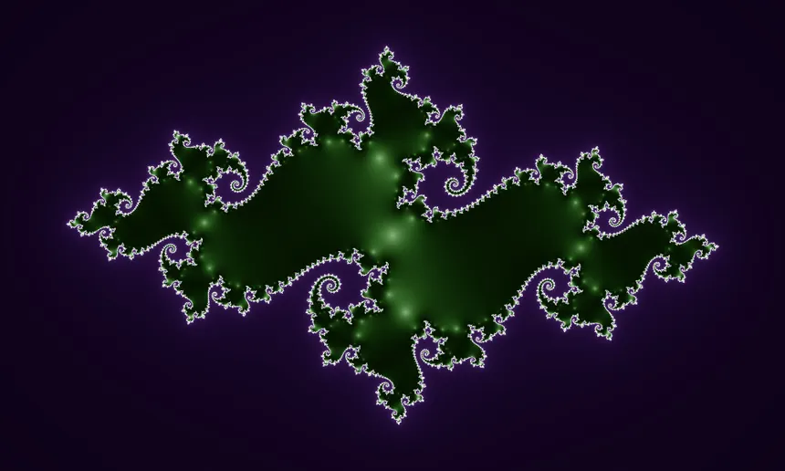

# 🌀 Fractol — Fractal Explorer in C


### A MiniLibX-based fractal rendering project

---

## 📖 Overview

**Fractol** is an interactive fractal visualization program built in **C** using the **MiniLibX** library. It allows you to explore famous fractal sets such as the **Mandelbrot** and **Julia** sets, zoom infinitely, and play with colors to reveal mesmerizing patterns.

---

## ⚙️ Features

* 🧠 **Mandelbrot & Julia sets** rendering
* 🖱️ **Mouse zooming** (in/out infinitely)
* 🎨 **Dynamic coloring** to visualize depth
* 🔢 **Custom Julia parameters** from CLI
* 💻 **Smooth window handling** (switch, minimize, etc.)
* 🧹 **Clean exit** on ESC or window close

---

## 🏗️ Build Instructions

Clone the repository and compile using `make`:

```bash
git clone https://github.com/didyounes/fractol.git
cd fractol
make
```

Available Makefile targets:

```bash
make all     # compile fractol
make clean   # remove object files
make fclean  # remove binaries + objects
make re      # rebuild everything
```

Ensure MiniLibX and the math library are linked properly:

```bash
LDFLAGS = -lmlx -lXext -lX11 -lm
```

---

## 🧮 Usage

```bash
./fractol <fractal_name> [parameters]
```

### Example:

```bash
./fractol mandelbrot
./fractol julia -0.7 0.27015
```

If no or invalid parameters are provided, the program will print the available options and exit gracefully.

---

## 🎮 Controls

| Key / Action              | Description                           |
| ------------------------- | ------------------------------------- |
| `Mouse Wheel`             | Zoom in/out                           |
| `ESC`                     | Quit the program                      |
| `Window Cross`            | Close window and exit                 |
| *(Optional)* `Mouse Move` | Change Julia parameters interactively |

---

## 🧱 Project Structure

```
fract-ol/
├── main.c           # Entry point of the program
├── mandelbrot.c     # Mandelbrot fractal implementation
├── julia.c          # Julia fractal implementation
├── c_str_d.c        # String and display helper functions
├── utils.c          # Utility functions
├── utils2.c         # Extra helper functions
├── h_mlx.h          # Main header file (includes structs, prototypes, etc.)
├── Makefile         # Build rules (make, clean, fclean, re)
└── README.md        # Project documentation

```
---

## 🧩 Technical Details

* Written in **C**
* Uses **MiniLibX** for graphics
* Math functions linked with `-lm`
* Uses `ft_printf` (or your own implementation)
* Complies with 42 project rules (no global vars)

---

## 🧪 Testing

Run Valgrind to check for leaks:

```bash
valgrind ./fractol mandelbrot
```

Zoom, resize, and switch windows — everything should remain smooth and responsive.

---

## Fractal Snapshots




---

## 💡 Tips

* Play with color formulas for unique visuals.
* Experiment with Julia parameters to generate different patterns.
* Use double precision (`double`) for smoother deep zooming.

---


## 🚀 Developer
**Younes El Joulali**  
[GitHub](https://github.com/didyounes) • [LinkedIn](https://www.linkedin.com/in/younes-el-joulali-7332a732a)

---

> “The more you zoom in, the more there is to discover — that’s the beauty of fractals.”
